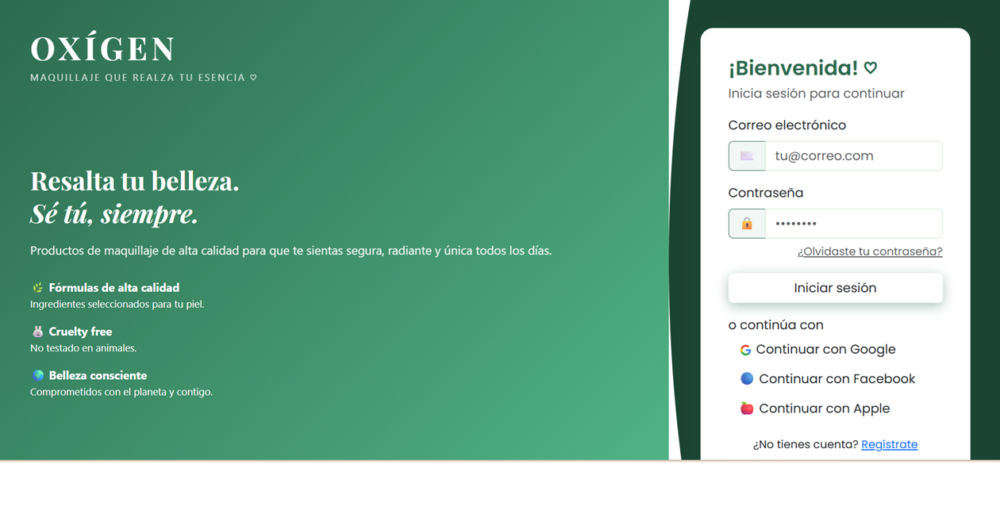
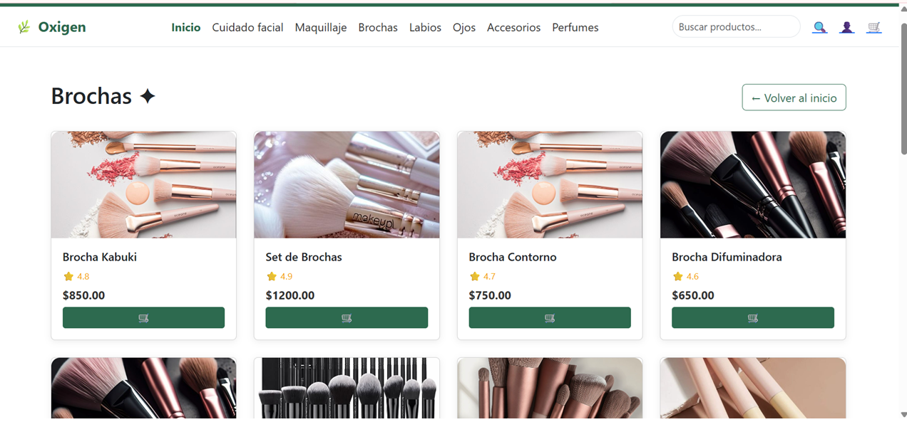
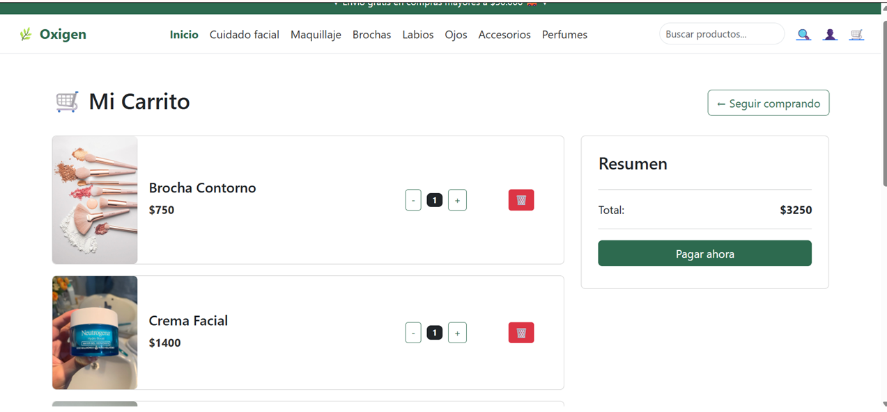
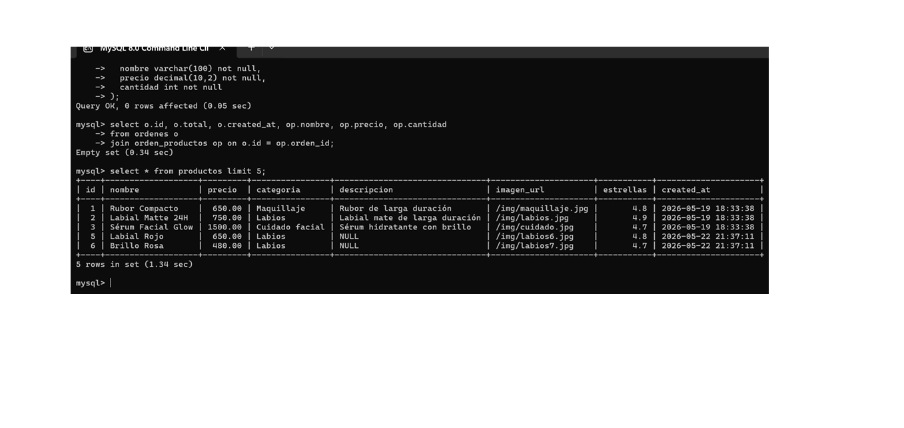

# 🌿 Oxigen Store

Sistema de Gestión de Contenidos Multimedia Dinámico - Tienda de cosméticos y maquillaje.

## 📋 Descripción del Proyecto

Oxigen Store es una tienda online de productos de belleza y maquillaje que permite a los usuarios explorar productos por categoría, agregarlos al carrito y realizar compras. El sistema incluye autenticación de usuarios y gestión de productos.

## 🛠️ Tecnologías

- **Node.js** v25.3.0
- **Express.js** v5.2.1
- **Express-Handlebars** v9.0.1
- **MySQL2** v3.x
- **Bootstrap** v5.3.0
- **Express-Session**
- **Bcryptjs**
- **Dotenv**

## 🚀 Instalación

1. Clonar el repositorio:
\`\`\`bash
git clone https://github.com/isispeguero26-ops/oxigen-store.git
cd oxigen-store
\`\`\`

2. Instalar dependencias:
\`\`\`bash
npm install
\`\`\`

3. Configurar variables de entorno:
\`\`\`bash
cp .env.example .env
\`\`\`

4. Ejecutar el servidor:
\`\`\`bash
node index.js
\`\`\`

## ⚙️ Variables de Entorno

Crear un archivo `.env` con las siguientes variables:

\`\`\`env
DB_HOST=localhost
DB_PORT=3306
DB_USER=tu_usuario
DB_PASSWORD=tu_contraseña
DB_NAME=oxigen_db
PORT=3000
\`\`\`

## 🗄️ Base de Datos

El sistema utiliza MySQL con las siguientes tablas:
- `productos` — Catálogo de productos
- `usuarios` — Usuarios registrados
- `ordenes` — Órdenes de compra
- `orden_productos` — Detalle de productos por orden

## 📸 Capturas de Pantalla

### Página de Login

### Página Principal

### Carrito de Compras

### Base de Datos MySQL

## 👩‍💻 Autora

**Isis Peguero y Camila Matias** - IPISA - Desarrollo de Portales Web y Multimedia